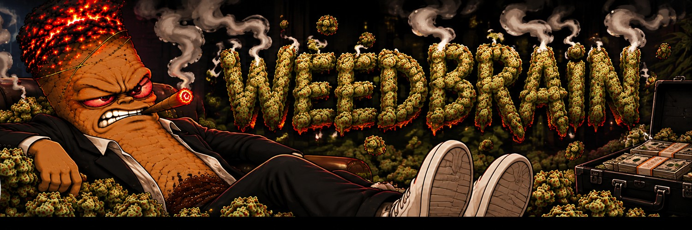

# WEEDBRAIN

A giant joint with a burning head lies in a pile of buds and smokes a smaller joint. He smokes himself.
Buys throw him joints, sells send buzzkills to put them out, the pile melts with the drawdown and one big sell knocks his mug over.
Everything he does is computed from the trades of one Pons v2 token on Robinhood Chain and anyone can recompute it.

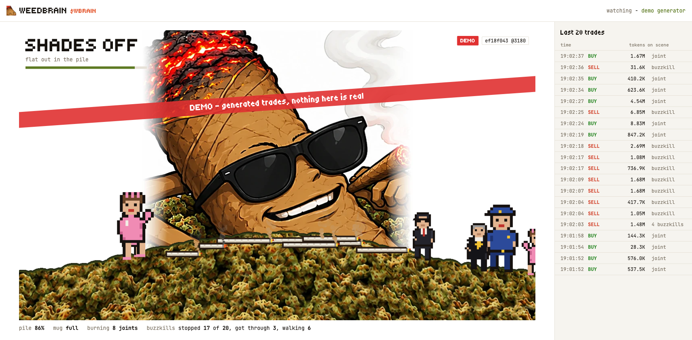

## Why a joint

A memecoin chart already reads like a mood. I wanted a character who feels it the way a holder does and the joint is the one who has the most to lose: every buy is more of what he is made of, every sell is someone coming to put him out. So he smokes himself and that has to be explained only once.

The burning tip on his head is the tell. Calm, it glows. Angry, it flares. It is in the art, not drawn by code and it gets worse stage by stage.

The story has a hinge. At first he is flat out in the pile with his shades on, then heavy-eyed, then reaching for his mug. A big sell knocks the mug over and pours it all over him and from there he is angry about something real: soaked, fists, the suit, the gun at the camera, firing and at the very bottom the whole frame blows apart. He does not die. The next buys bring him back and a fresh mug with them.

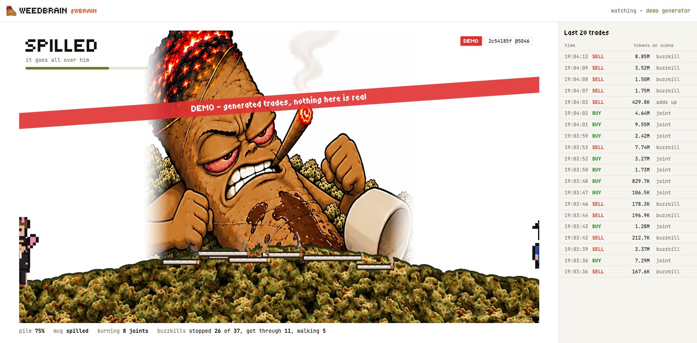

## The site

The site is built like a lab instrument, not a crypto landing page: paper background, thin rules, one accent (the ember orange), monospaced tabular numbers everywhere, headings small and rare.

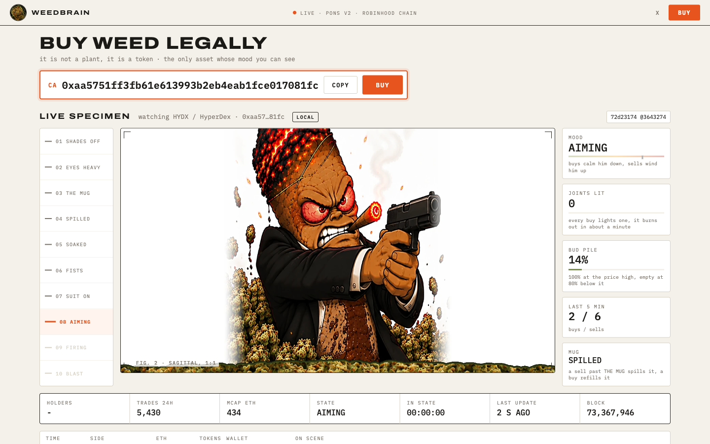

- **The first screen** is the live specimen. Above it only a short title and, under it, the contract in large type in an ember frame, a copy button and the buy button, which stays inactive until `ca` is set. The header with the buy button stays on top while scrolling.
- **The counters** under the scene: holders, trades in 24 h, market cap in ETH, the stage, the time in it, the last update and the block.
- **The live specimen** is the scene, with a ten-step scale on the left and gauges on the right, each with one line saying what it means (his mood, the joints lit, the bud pile, buys and sells in the last 5 minutes, the mug) and the trade tape under it, every row a Blockscout link. Each trade also pops a card in the corner for 4 s: a buy in orange with `+ETH` and `a joint lands`, a sell in red with `buzzkill incoming`. Buzzkills are not drawn walking on the scene anymore: the cards are where sells show up. When the mug goes, a full-width `THE MUG IS DOWN` card drops and the scene shakes.
- **The brain of a joint** is a made-up anatomy plate: a point cloud of about 58,000 neurons packed into bud-shaped lumps, with thin shells where the lobes end, drawn with three.js and turning slowly (drag to rotate). Six regions answer to the chain: a buy lights the CB1 LOBE, a sell heats the EMBER NUCLEUS, a buzzkill wakes the PARANOIA TRACT, a spill jolts the MUG CORTEX, the pile sets the BUD GANGLION and the MUNCHIE NERVE never stops. Hovering a region or its label dims the rest and opens a card. Under it a coupling matrix, the buys and sells of the last 5 minutes with the mood line and a count of cell types, all moving with the trades. It says it is a joke under the plate, because it is.
- **The rest:** the three rules, the ten states (hover plays the clip, the current one is outlined), what this is not, the footer.

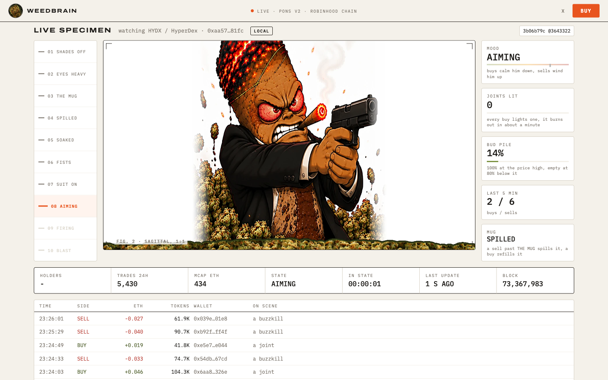

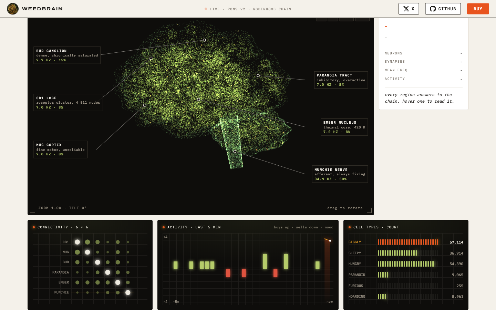

Holders are counted by replaying the token's `Transfer` events from its launch block in the browser, because the Blockscout API answers this network with a Cloudflare challenge and the Pons API allows 8 calls a minute. The curve, the pool manager and the zero address are not holders. The market cap is the last trade price times the total supply, in ETH. `weedbrain.html` is the live specimen alone, for a second screen or a stream.

## How it maps to the chain

Nothing here is a metaphor. Each rule maps to one thing on the chain.

| on the scene | on the chain |
|---|---|
| a joint drops into the pile | a buy: `CurveBuy` on the token's bonding curve, or a Uniswap v4 swap into the token after graduation |
| its length | the size of the buy, on a log scale with a ceiling |
| a lighter flash that pushes back the nearest buzzkill | the same buy |
| a buzzkill wades in | a sell: `CurveSell`, or a v4 swap out of the token |
| which buzzkill (cop, mom, fed, priest) | the transaction hash picks it, not me |
| a buzzkill reaches him and douses the longest joint | the sell arriving, a big one douses two |
| the bud pile, waist-high at the high, gone at 80% down | `1 - price / high`, plus a debt for every buzzkill that got through, which heals slowly |
| every trade moves his mood at once | a buy one to three stages toward SHADES OFF, a sell one to three toward BLAST, more for a bigger trade |
| the mug goes over | a sell that pushes him past THE MUG, or one of at least 0.1 ETH and five times the token's recent flow, which drops him two stages |
| between trades | the mood drifts back to where the pile and the burning joints put it, over about 2 minutes |

The trader is read from the event fields (the recipient of a buy, the seller of a sell), not from the transaction sender. On this chain a relayer submits most transactions, so `tx.from` is infrastructure.

## The ten stages

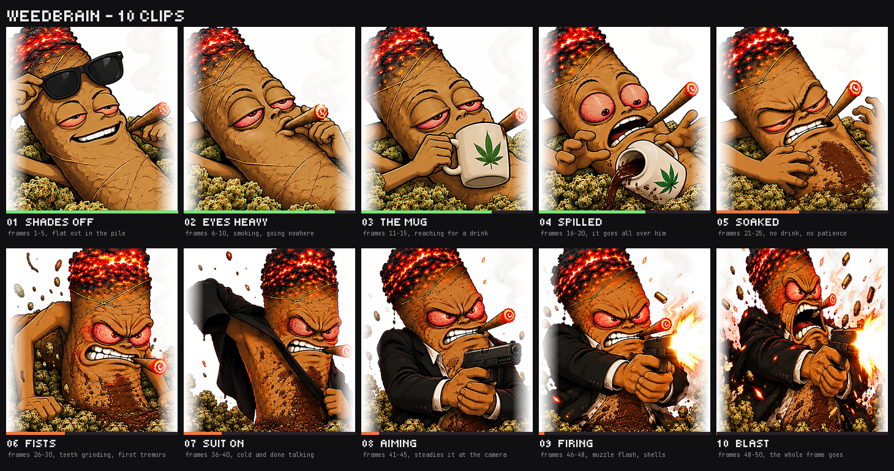

| # | stage | frames | what he does |
|---|---|---|---|
| 1 | SHADES OFF | 1-5 | flat out in the pile, takes the shades off |
| 2 | EYES HEAVY | 6-10 | smoking, going nowhere |
| 3 | THE MUG | 11-15 | reaches for his mug and drinks |
| 4 | SPILLED | 16-20 | the mug tips and goes all over him |
| 5 | SOAKED | 21-25 | no drink, no patience |
| 6 | FISTS | 26-30 | teeth grinding, first tremors |
| 7 | SUIT ON | 36-40 | cold and done talking |
| 8 | AIMING | 41-45 | the gun at the camera |
| 9 | FIRING | 46-48 | muzzle flash, shells |
| 10 | BLAST | 48-50 | the whole frame goes |

Frames 31-35 do not exist in the art set. Stage 7 starts at frame 36.

Every trade moves him right away: the smallest one stage, the biggest three, buys up the ladder and sells down it. On the 48 hours of HYDX since launch 91.3% of trades moved his mood; the rest hit him at the top or the bottom of the ladder, at a fresh mug or were dust. The mug splits the ladder: the sell that takes him past THE MUG knocks it over and SPILLED plays first and the buy that brings him back above SPILLED brings a fresh one.

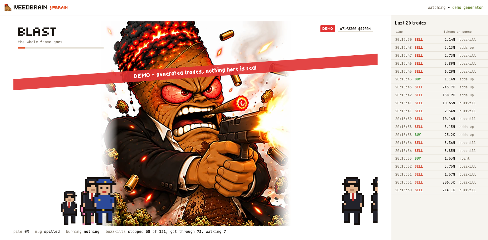

## The key property

The state is a pure function of three things: the genesis seed, the ordered trade log and the step number. There is no `Math.random` and no clock inside the simulation and it does not care about frame rate. The live page prints a hash of the state in the corner. Two screens on the same step print the same line.

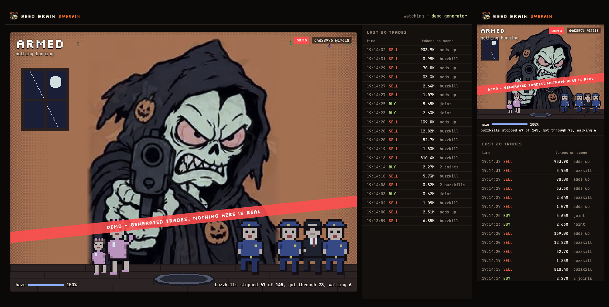

Above: a 1280 px window at a device pixel ratio of 2 and a 390 px phone viewport on the same demo step both show `c71f8300 @19004`. On the phone the scene is cropped to its middle square; the state is the same.

## Quick start

```
npm install
npm run serve
```

Then open http://localhost:8080/weedbrain.html for the scene and http://localhost:8080/ for the landing page. `npm install` only pulls `viem`, which the tests use to cross-check my own keccak and ABI decoding. The site itself has no dependencies.

## Modes

| mode | data source | same state for every viewer | what it needs |
|---|---|---|---|
| `direct` | the browser reads the public RPC | should be (same genesis block and seed), but nothing enforces it | static hosting only. Badge `LOCAL` |
| `collector` | `ingest/ingest.js` writes the log to shared files and every viewer reads them | yes, one log | a machine that runs the collector, plus hosting for `data/`. Badge `SYNC` |
| `demo` | a seeded generator makes up the trades | yes within each hour | nothing. Badge `DEMO` and a red band across the scene |

The mode and the token come from `src/weedbrain.config.json`. An empty `token` means demo. In demo mode `?at=<time>&hold` freezes the scene at one moment, which is how the screenshots above were taken.

## Run it on any token

The token address is never hard-coded. It comes from the config or from the command line, so any Pons v2 token works, which is how I tested all of this before my own token exists.

```
node tools/watch.js 0xTOKEN              watch a token in the terminal
node tools/replay.js --token 0xTOKEN     replay its history and print the state
npm run serve -- --token 0xTOKEN         serve the site on that token
node tools/find-active.js                list the busiest tokens right now and their stage
```

For a token that has been trading for a while, `--lookback 60` starts the watch an hour back (rounded down to an hour grid of 36,000 blocks, so viewers in the same hour share a genesis). For my own token the genesis is its launch block.

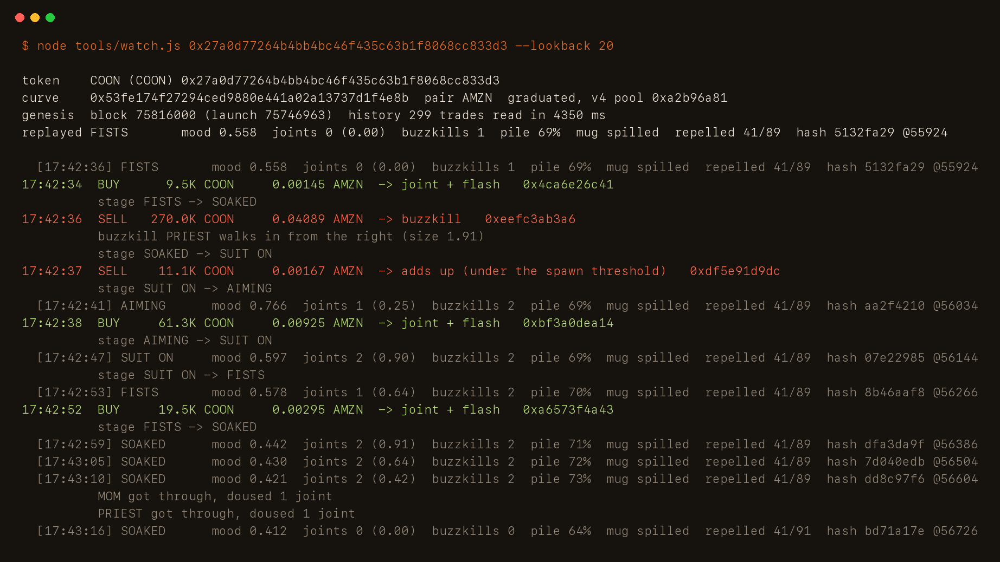

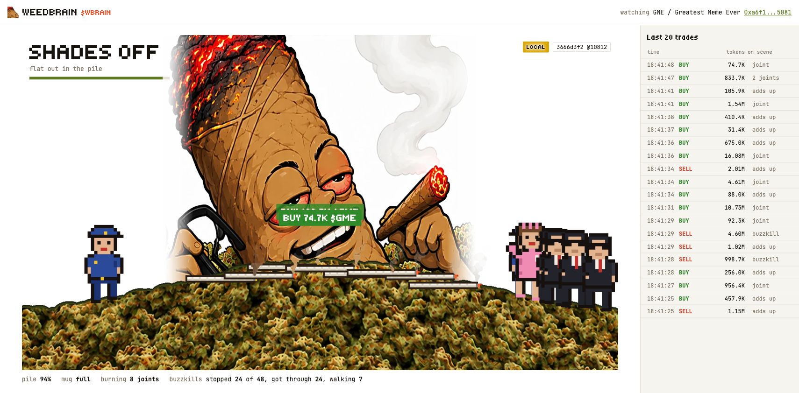

## Log format

One line per trade, sorted by step, then block, then log index, then transaction hash.

```
step,side,eth,tok,px,blk,li,tx
4,1,0.1,52357261.312485196,1.7728199999999999e-9,72329680,2,0xa95611432ea5015f1cacbf5e860572b00813d45156d85a7d73d89e3177d35fca
4,1,0.06,28862878.34205358,1.9295372879999998e-9,72329680,5,0xa7431cc0cae6bb09ee7854f682549503fb4939116b18a62ec645bbf7a671c9b0
```

`step` is `(block - genesis block) * 2`: a block is about 101 ms and a step is 50 ms, so every block gets two steps and the simulation clock comes from block numbers, not from anyone's watch. `side` is +1 for a buy and -1 for a sell. `eth` is the quote amount (ETH for ETH-paired tokens), `tok` the token amount and `px` the trade price. Numbers are written at full precision because the hash covers their exact bits.

## State snapshots

In collector mode a client does not replay from genesis. It reads `data/state.json`, the latest snapshot and only replays the log after it. A snapshot holds every field and every entity in flight (burning joints, walking buzzkills, the mug and its timers) at full precision, plus its own hash and a client refuses a snapshot whose contents do not match that hash. The collector writes one every 6,000 steps (5 minutes). A restore from a snapshot ends on the same hash as a full replay (`test/determinism.test.js`, snapshots taken at four different steps of a real log).

## Verify

```
$ node tools/replay.js --token 0xa6f1951bc0b13893756f7ae51a4956f97d485081 --lookback 60
```

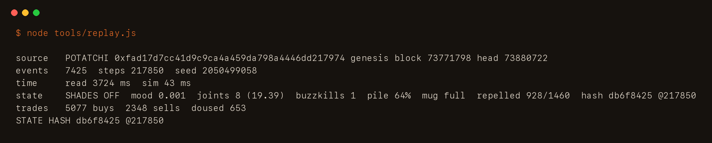

The hash `replay.js` prints for a step must be the one the page shows for that step. I checked it four ways on the current engine:

- the live page against replay, direct mode on GME: the page showed `2e3f1698 @10632`, `replay.js --token ... --lookback 60 --to 10632` printed `2e3f1698`
- the collector against replay: the collector wrote `e7b273bb @12268` into `meta.json`, `replay.js --log data/events --to 12268` printed `e7b273bb`
- the page in SYNC mode against replay: the page showed `7a42cddc @12384`, `replay.js` at step 12384 printed `7a42cddc`
- two viewports on the demo: `c71f8300 @19004` on both, one of them at a device pixel ratio of 2

## Tests

```
npm test                 all 36 tests (node --test)
node tools/profile.js    render time per phase in the worst scene
node tools/economy.js    stage time, spawns and spills on the real trade fixtures
node tools/rpc-check.js  block time, RPC latency and log limits, measured now
```

| file | checks |
|---|---|
| `test/determinism.test.js` | the same hash at 1, 3, 17, 60 and 1,000 steps per frame, on irregular frames, under a 0.01 ms catch-up budget, after a restore from any snapshot and for two demo viewers who open the page 25 minutes apart |
| `test/economy.test.js` | on two real tokens (one on the curve, one graduated to v4) he visits at least six stages and no stage takes more than 60% of the time. Every trade moves the mood one to three stages by its size and over 9 in 10 trades of a real graduated token move it. A sell past THE MUG tips the mug with SPILLED shown first, one big sell drops him two stages. Also the log size mapping, aggregation on a token with 9,600 trades a minute, a fresh launch that pumps past 1,000x and retraces 47% and the extremes (only buys, only sells) |
| `test/feed.test.js` | a fake node with random latency, a head that runs ahead of its logs, a 10,000-log style refusal and a graduation halfway through: no trade lost, none late. A control run with a node lagging past the safety margin does lose trades, so the test can fail |
| `test/edge.test.js` | garbage events, prices from 1e-12 to 1e12, 300,000 steps, late events, tampered snapshots, the RNG sign trap, my keccak and v4 pool id against viem and real captured logs decoding to the side their token `Transfer` shows |

The real trade fixtures in `test/fixtures` were captured with `tools/capture-fixture.js` from SNIFFR (on the curve) and FOMOFIED (graduated, trading on its v4 pool).

## The art

The 45 source frames are 1400 x 1400 (`art/frames`). They were cut out of a sheet and come in two shapes: three of every five are a 1280 x ~1370 picture with white margins, a border line and a sliver of the next panel under it and the other two are the same picture squashed into 1400 x 1017. `tools/make-frames.py` finds the picture inside each frame and resizes every one to the same 672 x 720 box, which undoes the squash. On frames 3 and 4 the mean pixel difference after that is 48.8, against 44.6 between two neighbours of the same shape and 77.7 if the squashed frame is only scaled. Nothing is redrawn and nothing goes above its source size.

`tools/make-clips.py` builds the ten clips from those frames in three variants each, with the stage name and level bar, clean for the site and 1280 x 720 for posts, as webp and gif.

## Layout

```
src/
  index.html              the site
  weedbrain.html          the live specimen alone
  site.js site.css        the pages: header, hero, bench, toasts, tape, atlas, panels
  live.js                 config, feed and the sim loop the pages share
  brain3d.js brain.js     the brain plate (WebGL point cloud, flat fallback)
  stats.js                holders, trades in 24 h, market cap
  engine.js               the simulation (SIM), no drawing
  render.js sprites.js    the renderer (RENDER), no state
  feed.js                 trade log, direct / collector / demo sources
  chain.js keccak.js      Pons v2 reader over plain JSON-RPC
  weedbrain.config.json   token, mode, links
  frames/                 45 scene frames and the bud texture of the pile
  clips/                  the ten clean clips for the landing page
ingest/                   the collector
tools/                    serve, watch, replay, profile, economy, fixtures, frames, clips, images, deploy
test/                     node --test suites and real trade fixtures
art/                      the 45 source frames and the two fonts the clips use
docs/                     ARCHITECTURE, ECONOMY, FEED, STORAGE, RUNBOOK, TESTPLAN
```

## Limits

- It does not trade, sign or hold anything. There are no keys in this repository and CI fails the build if `PRIVATE_KEY`, `privateKeyToAccount`, `signTransaction` or `sendTransaction` show up in the source.
- It is not trustless. The state comes from public trades and you can recompute it, but in collector mode the log is written by a process I run and the site is hosted by me.
- In direct mode each browser reads the RPC on its own. Viewers should agree, but nothing forces them to.
- The price and the high are used inside the simulation to size the pile. The page never shows a price.
- For tokens paired with something other than ETH the size mapping and the spill size still read the quote amount, which is then not ETH. My token is ETH-paired.
- The buzzkills (ink silhouettes), the joints in the pile and the lighter are pixel sprites drawn by code. The character is the art set and nothing else.
- The brain plate is a joke with real inputs: the regions, neuron counts and frequencies are made up, only their movement comes from the chain. It uses three.js from cdnjs, the only script loaded from outside and falls back to a flat drawing without WebGL.
