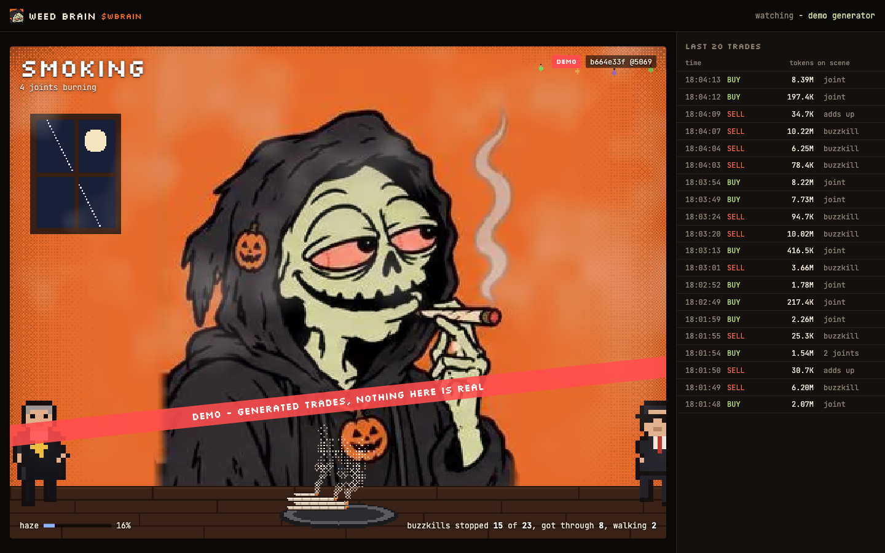
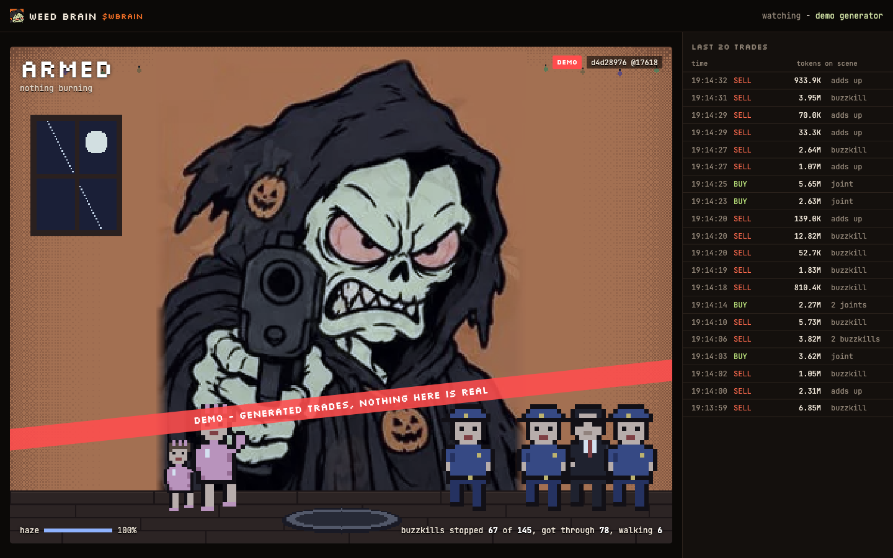

# WEED BRAIN

A reaper in a hood smokes on the money of one Pons v2 token on Robinhood Chain.
Buys keep him high, sells send people to put him out and the haze in his room is the drawdown from the high.
Everything he does is computed from the token's trades and anyone can recompute it.



## Why a reaper

It is Halloween season and a memecoin chart already looks like a mood disorder. I wanted something that feels a chart the way a holder does: calm and giggling in the candy while the buys roll in, then a slow sobering up, then the jaw, the yelling and at the very bottom the gun. The reaper does not die. Death is his job, so he just sits there armed and waits for the next buy to start bringing him back.

He smokes because a joint is the right unit for a buy: it is small, it burns down on its own and several of them can go at once. A sell needs someone to walk in and ruin it, so sells are buzzkills: a cop, a mom, a fed or a priest.



## How it maps to the chain

Nothing here is a metaphor. Each rule maps to one thing on the chain.

| on the scene | on the chain |
|---|---|
| a joint drops into the ashtray | a buy: `CurveBuy` on the token's bonding curve, or a Uniswap v4 swap into the token after graduation |
| its length | the size of the buy, on a log scale with a ceiling |
| a lighter flash that pushes back the nearest buzzkill | the same buy |
| a buzzkill walks in | a sell: `CurveSell`, or a v4 swap out of the token |
| which buzzkill | the transaction hash picks it, not me |
| a buzzkill reaches him and douses the longest joint | nothing new: it is the sell arriving, a big one douses two |
| the haze, colder light, less smoke | `1 - price / high`, plus a debt for every buzzkill that got through, which heals slowly |
| the stage (ten of them) | how much is burning against how thick the haze is |

The trader is read from the event fields (the recipient of a buy, the seller of a sell), not from the transaction sender. On this chain a relayer submits most transactions, so `tx.from` is infrastructure.

## The key property

The state is a pure function of three things: the genesis seed, the ordered trade log and the step number. There is no `Math.random` and no clock inside the simulation and it does not care about frame rate. The live page prints a hash of the state in the corner. Two screens on the same step print the same line.


Above: a desktop window and a 390 px phone viewport at step 17618 both show `d4d28976 @17618`. I also checked it at a device pixel ratio of 2 and got the same hash.

## Quick start

```
npm install
npm run serve
```

Then open http://localhost:8080/weedbrain.html for the scene and http://localhost:8080/ for the landing page. `npm install` only pulls `viem`, which the tests use to cross-check my own keccak and ABI decoding. The site itself has no dependencies.

## Modes

| mode | data source | same state for every viewer | what it needs |
|---|---|---|---|
| `direct` | the browser reads the public RPC | should be (same genesis block and seed), but nothing enforces it | static hosting only. Badge `LOCAL` |
| `collector` | `ingest/ingest.js` writes the log to shared files and every viewer reads them | yes, one log | a machine that runs the collector, plus hosting for `data/`. Badge `SYNC` |
| `demo` | a seeded generator makes up the trades | yes within each hour | nothing. Badge `DEMO` and a red band across the scene |

The mode and the token come from `src/weedbrain.config.json`. An empty `token` means demo.

## Run it on any token

The token address is never hard-coded. It comes from the config or from the command line, so any Pons v2 token works, which is how I tested all of this before my own token exists.

```
node tools/watch.js 0xTOKEN              watch a token in the terminal
node tools/replay.js --token 0xTOKEN     replay its history and print the state
npm run serve -- --token 0xTOKEN         serve the site on that token
node tools/find-active.js                list the busiest tokens right now
```

For a token that has been trading for a while, `--lookback 60` starts the watch an hour back (rounded down to an hour grid of 36,000 blocks, so viewers in the same hour share a genesis). For my own token the genesis is its launch block.


## Log format

One line per trade, sorted by step, then block, then log index, then transaction hash.

```
step,side,eth,tok,px,blk,li,tx
4,1,0.1,52357261.312485196,1.7728199999999999e-9,72329680,2,0xa95611432ea5015f1cacbf5e860572b00813d45156d85a7d73d89e3177d35fca
4,1,0.06,28862878.34205358,1.9295372879999998e-9,72329680,5,0xa7431cc0cae6bb09ee7854f682549503fb4939116b18a62ec645bbf7a671c9b0
```

`step` is `(block - genesis block) * 2`: a block is about 101 ms and a step is 50 ms, so every block gets two steps and the simulation clock comes from block numbers, not from anyone's watch. `side` is +1 for a buy and -1 for a sell. `eth` is the quote amount (ETH for ETH-paired tokens), `tok` the token amount and `px` the trade price. Numbers are written at full precision because the hash covers their exact bits.

## State snapshots

In collector mode a client does not replay from genesis. It reads `data/state.json`, the latest snapshot and only replays the log after it. A snapshot holds every field and every entity in flight (burning joints, walking buzzkills) at full precision, plus its own hash and a client refuses a snapshot whose contents do not match that hash. The collector writes one every 6,000 steps (5 minutes). On the SNIFFR log a restore from a snapshot ends on the same hash as a full replay (`test/determinism.test.js`, snapshots taken at four different steps).

## Verify

```
$ node tools/replay.js --token 0x2f62eb241876cd49eb9135824a893ae62912434a
```


The hash `replay.js` prints for a step must be the one the page shows for that step. I checked it five ways:

- collector against replay: the collector wrote `72cdd580 @28160` into `meta.json` and `replay.js --log data/events --to 28160` printed `72cdd580`
- page in SYNC mode against replay: the page showed `043972fd @28359` and `replay.js` at step 28359 printed `043972fd`
- across an hourly shard rollover: the collector's `d84d1c57 @52144`, read from two shards, matched `replay.js`
- two viewports on the demo: `d4d28976 @17618` on both
- the deployed site against my machine: https://weedbrain.vercel.app in a browser showed `856dc7e0 @69652` on SNIFFR, and `replay.js --token ... --lookback 60 --to 69652` printed `856dc7e0`

## Tests

```
npm test                 all 33 tests (node --test)
node tools/profile.js    render time per phase in the worst scene
node tools/economy.js    stage time and spawn counts on the real trade fixtures
node tools/rpc-check.js  block time, RPC latency and log limits, measured now
```

| file | checks |
|---|---|
| `test/determinism.test.js` | the same hash at 1, 3, 17, 60 and 1,000 steps per frame, on irregular frames, under a 0.01 ms catch-up budget, after a restore from any snapshot and for two demo viewers who open the page 25 minutes apart |
| `test/economy.test.js` | on two real tokens (one on the curve, one graduated to v4) he visits at least six stages and no stage takes more than 60% of the time. Also the log size mapping, aggregation on a token with 9,600 trades a minute, a fresh launch that pumps past 1,000x and retraces 47% and the extremes (only buys, only sells) |
| `test/feed.test.js` | a fake node with random latency, a head that runs ahead of its logs, a 10,000-log style refusal and a graduation halfway through: no trade lost, none late. A control run with a node lagging past the safety margin does lose trades, so the test can fail |
| `test/edge.test.js` | garbage events, prices from 1e-12 to 1e12, 300,000 steps, late events, tampered snapshots, the RNG sign trap, my keccak and v4 pool id against viem and real captured logs decoding to the side their token `Transfer` shows |

The real trade fixtures in `test/fixtures` were captured with `tools/capture-fixture.js` from SNIFFR (on the curve) and FOMOFIED (graduated, trading on its v4 pool).

## Layout

```
src/
  index.html              landing page
  weedbrain.html          the live scene
  app.js app.css          the page: boot, loop, HUD, trade feed
  engine.js               the simulation (SIM), no drawing
  render.js sprites.js    the renderer (RENDER), no state
  feed.js                 trade log, direct / collector / demo sources
  chain.js keccak.js      Pons v2 reader over plain JSON-RPC
  weedbrain.config.json   token, mode, links
  frames/                 50 cleaned frames and the atlas the page loads
ingest/                   the collector
tools/                    serve, watch, replay, profile, economy, fixtures, images
test/                     node --test suites and real trade fixtures
art/raw/                  the 50 source frames
docs/                     ARCHITECTURE, ECONOMY, FEED, STORAGE, RUNBOOK, TESTPLAN
```

## Limits

- It does not trade, sign or hold anything. There are no keys in this repository and CI fails the build if `PRIVATE_KEY`, `privateKeyToAccount`, `signTransaction` or `sendTransaction` show up in the source.
- It is not trustless. The state comes from public trades and you can recompute it, but in collector mode the log is written by a process I run and the site is hosted by me.
- In direct mode each browser reads the RPC on its own. Viewers should agree, but nothing forces them to.
- The price and the high are used inside the simulation to compute the haze. The page never shows a price.
- For tokens paired with something other than ETH the size mapping still reads the quote amount, which is then not ETH. My token is ETH-paired.
- The frames are 252 x 316. On a big monitor they are scaled up with visible pixels, not redrawn.
